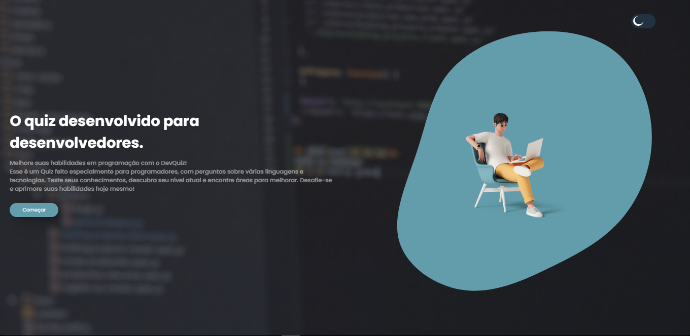
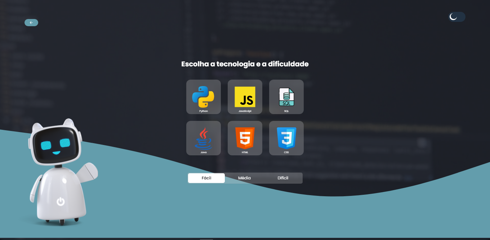
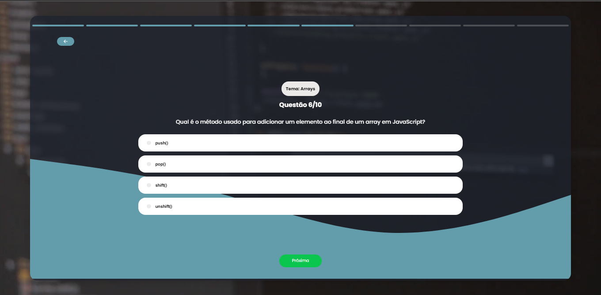
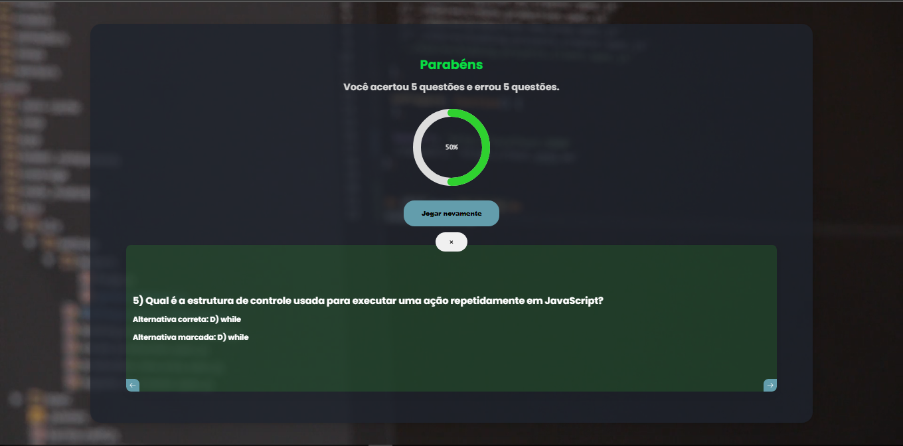

O objetivo principal do projeto é aprimorar minhas habilidades com ReactJS. Nesse projeto utilizo algumas tecnologias que me auxiliaram no desenvolvimento desse projeto: FontAwesome, uma ferramenta que disponibiliza vários ícones de forma gratuita, o ChatGPT que criou todas as perguntas, entre outras ferramentas integradas ao React. A aplicação é simples e intuitiva:
<ol> 

<li> Clique em começar.</li>
<li> Escolha o tema e a dificuldade das perguntas.</li>
<li> Responda as perguntas. </li>
<li> Visualize o resultado e as respostas corretas. </li>

</ol>
A aplicação continua em desenvolvimento, em breve, adicionarei um timer, integrarei ao banco de dados e criarei um componente de login para o usuário, um ranking de pontos e a adição de novas perguntas.

 

  
  
  
  

 Ferramentas utilizadas:

 

 

Meu linkedin:

  
